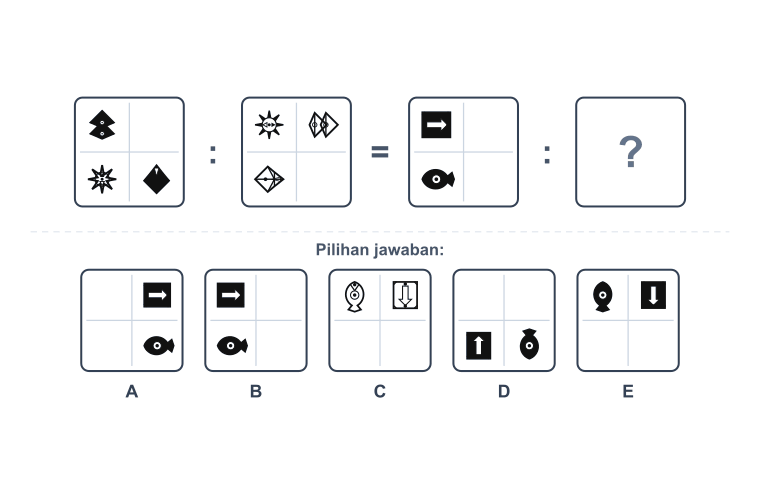

<h1 align="center">Hi 👋, I'm Cahyono</h1>
<h3 align="center">Software Engineer · Frontend & Backend · UI/UX Enthusiast — Tangerang, Indonesia 🇮🇩</h3>

<p align="center">
  <a href="https://cahyono.my.id"></a>
  <a href="https://www.linkedin.com/in/cahyono99/"></a>
  <a href="mailto:cahyono060799@gmail.com"></a>
  
</p>

---

### 🚀 About Me

- 🔭 Lagi ngerjain **platform belajar & tryout AI** (Next.js + Gemini + Prisma) untuk persiapan CPNS, UTBK & ujian sekolah
- 🌱 Lagi mendalami **testing frameworks**, **system design**, dan **UI/UX principles**
- 💬 Tanya gue soal **Vue / Nuxt / React / Next.js** atau diskusi CSS framework (gue udah coba 5+ 😅)
- 🎯 Fokus: bikin produk yang dipakai orang beneran, bukan cuma demo

---

### 🛠️ Tech Stack

**Frontend**


**Backend & CMS**


**Database**


**Styling**


**Tools**


---

### 📊 GitHub Stats

<p align="center">
  
  
</p>

<p align="center">
  
</p>

<p align="center">
  
</p>

---

### 🧠 Case Study — Figural Engine (nilaia.com)

> Membangun engine **deterministik** untuk men-generate soal penalaran figural (Diagrammatic & Abstract Reasoning) gaya ujian CPNS/TIU — tanpa mengandalkan AI untuk menggambar.

<div align="center">
  
  <br/><sub>Output asli engine — tiap soal (visual + kunci jawaban) dihasilkan otomatis & deterministik.</sub>
</div>

**🔴 Masalah.** Soal figural (analogi gambar, deret gambar, ketidaksamaan, diagrammatic reasoning) butuh visual yang **presisi piksel** dan **kunci jawaban yang pasti benar**. Model AI generatif (image & SVG) konsisten gagal di sini: koordinat meleset, bentuk rusak, dan — yang paling fatal — **kunci jawabannya tidak bisa dipercaya**. Untuk produk ujian, satu kunci salah = kepercayaan pengguna hilang.

**🟢 Pendekatan.** Alih-alih "meminta AI menggambar", saya membalik masalahnya: **biarkan kode yang menggambar dan menghitung jawaban, AI hanya menyusun teks.**

```
config aturan  →  render SVG (kode)  →  hitung kunci jawaban (kode)  →  teks (AI, opsional)
   (deterministik, 0 token)              (dijamin benar)
```

- Visual & kunci jawaban dihasilkan **100% deterministik** oleh kode → **0 token AI**, reproducible, dan kunci jawaban **mustahil salah** karena dihitung dari aturan yang sama yang menggambarnya.
- AI hanya dipakai untuk merangkai *teks* pertanyaan/pembahasan pada sub-tipe tertentu — bukan untuk logika atau gambar.

**⚙️ Yang saya rancang.**
- Pustaka **80+ bentuk geometris** sebagai SVG primitif, dipakai lintas semua tipe soal dari satu sumber render.
- Sistem **rotasi anti-monoton** sehingga variasi soal maksimal dan pola tidak mudah ditebak/berulang.
- Beberapa keluarga aturan transformasi (rotasi, operator-chain, matriks) dengan **kontrol tingkat kesulitan** bertingkat.
- Distraktor (opsi pengecoh) yang dihasilkan terukur, bukan acak — agar soal pilihan ganda berkualitas.

**📊 Dampak.**
- Soal figural tak terbatas, **biaya AI ~nol** untuk komponen visual, dan **akurasi kunci jawaban 100%**.
- Menjadi pembeda teknis utama produk dibanding pendekatan berbasis AI murni yang rapuh di ranah visual.

<sub>💡 Konsep procedural reasoning generation memang dikenal di riset (Raven's Matrices, DeepMind PGM). Kontribusi saya: mengadaptasinya menjadi engine produksi TypeScript/SVG yang ter-tuned untuk **sub-tipe TIU otentik Indonesia** di dalam platform nyata. Kode bersifat proprietary — happy to discuss the approach.</sub>

---

### 📌 Featured Projects

| Project | Description | Tech |
|---|---|---|
| [**Nilaia — App Android**](https://github.com/yono99/nilaia-app) | Platform belajar & simulasi CAT (CPNS/UTBK) dengan AI question generation & figural reasoning engine · [nilaia.com](https://nilaia.com) | Next.js · Prisma · Gemini · Supabase |
| [**Vue Express TS Auth Starter**](https://github.com/yono99/vue-express-ts-auth-starter-TypeORM) | Boilerplate auth fullstack TypeScript dengan TypeORM | Vue · Express · TypeORM |

---

<p align="center"><i>⭐️ From <a href="https://github.com/yono99">yono99</a></i></p>
